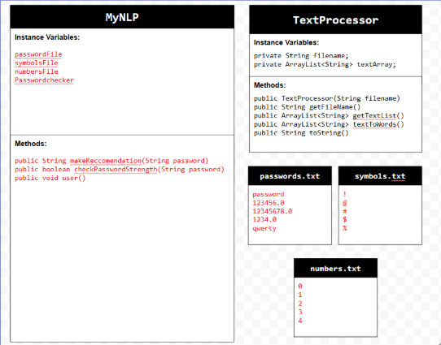
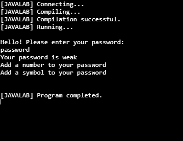

# Unit 6 - Natural Language Processing Project

## Introduction

Natural language processing (NLP) is used in many apps and devices to interact with users and make meaning of text to determine how to respond, find information, or to create new text. Your goal is to use natural language processing techniques to identify structure, patterns, and meaning in a text to have conversations with a user, execute commands, perform manipulations on the text, or generate new text.

## Requirements

Use your knowledge of object-oriented programming, ArrayLists, the String class, and algorithms to create a program that uses natural language processing techniques:

- **Create at least two ArrayLists** – Create at least two ArrayLists to store the data used in your program, such as data from text files or entered by the user.
- **Implement one or more algorithms** – Implement one or more algorithms that use loops and conditionals to find or manipulate elements in an ArrayList or String object.
- **Use methods in the String classs** - Use one or more methods in the String class in your program, such as to divide text into sentences or phrases.
- **Use at least one natural language processing technique** – Use a natural language processing technique to process, analyze, and/or generate text.
- **Document your code** – Use comments to explain the purpose of the methods and code segments and note any preconditions and postconditions.

## UML Diagram

Put and image of your UML Diagram here. Upload the image of your UML Diagram to your repository, then use the Markdown syntax to insert your image here. Make sure your image file name is one word, otherwise it might not properly get display on this README.

UML Diagram for my project

## Video

Record a short video of your project to display here on your README. You can do this by:

- Screen record your project running on Code.org.
- Upload that recording to YouTube.
- Take a thumbnail for your image.
- Upload the thumbnail image to your repo.
- Use the following markdown code:

Thumbnail for my projet(https://youtu.be/WHTL82vYE6M)

## Project Description

The goal of my code was to check a user's password strength. When the user is prompted, they will input their password into the code, then after pressing enter, the code will return whether or not the user's password is weak or strong and what the user can do in order to improve the strength of their password. The code does this by reading through a passwords.txt file and if the user's inputted password matches any of the passwords in the txt file, their password will be returned as weak, otherwise the password is a strong password. 

## NLP Techniques
The NLP technique I used for this project was password strength. Password strength determines how strong a password is to crack using a word list of common passwords, and analyze the characters used in the password. The method in my program that uses this passwords.txt file is checkPasswordStrength. This method This method traverses through the password ArrayList written by the user and uses a file reader to do that. It will get the user password using a .get method and then will check if the password matches anything in the password.txt file and if it does it will return false which means it is a weak password, otherwise it returns true which means the password is strong.